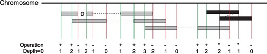
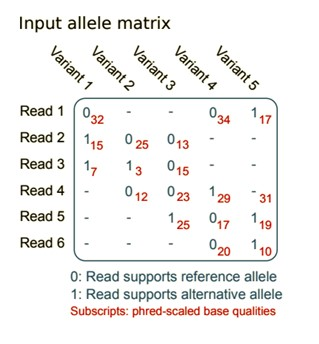
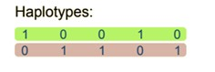

If genetics is not in your field of experience, as a newcomer it feels a lot like being given a jigsaw puzzle with exactly 2,697,890,418 pieces with no reference picture. Your task is to find out how to put it together exactly. But it doesn’t stop there - Let’s say you want to find 5 pieces that have the same pattern in a different puzzle and that 2-billion-piece puzzle is partially put together in fragments. How do we even start? Herein lies the challenge of genetic research and the powerful use of statistics.

This term as a first-year graduate student in Statistics at Oregon State, I had the opportunity to work alongside some of OSU’s novel research on plant genetics.  Over the course of three months, my classmates and I worked hard on formulating scientific questions in genomics research and translating them into statistical problems. Along the way, we got to as an interdisciplinary team on current research projects. 

## Finding the Edge Pieces: Phased-Based Sequencing 

The project we had the opportunity to work on was to use phased based sequencing to reconstruct a haplotype.  Why would this be important? In genetics we can use sequencing to identify a particular location of a gene of interest to further promote said traits. In our case we were looking for these genes in hazelnut DNA that are disease resistant. 
Haplotype phasing is an attempt to refine a genome by identifying where the alternative form of a gene, known as an allele, is located on one of the two inherited parental chromosomes. thus, we have information for both chromosomes of a chromosome pair. 

#### Finding similar jigsaw pieces- DNA Reads
Remember from our old Biology courses the AGTC pairs? Well, if we move this into sequencing, this information is very useful for reconstructing the haplotypes! Formally, the Heterozygous assumption states that for all base pairs, there is a complement to them that is one of 4 choices AGTC. With this information, now all we must do is solve each of the compliments to these fragments and compile them together in a reconstructed haplotype.  This is the first part of sequencing. 
These fragments are also known as reads, which are inferred sequence of base pairs (or base pair probabilities) corresponding to all or part of a single DNA fragment. The way that these reads are put together are much like layers of thin paper that reveal a significant pattern such as below. 

In this figure we see that there are overlapped grey blocks of reads that are aligned overtop each other at certain points. The amount of overlap is referred to as the depth. Stronger depth can reveal the true sequencing for the complete haplotype block, and we are one step closer towards revealing a more complete picture. Puzzle solved right?-Well not exactly.

Reads alone cannot put together the puzzle completely.They are just small tidbits of information that give us fragmented pieces of a reconstructed puzzle- which may or may not be accurate. Several software tools have been developed and improved upon throughout the past 31 years to try and reconstruct these pieces. The approaches include statistical modeling to determine the probability of a specific haplotype phasing result, as well as computational methods that rely on rule-based methods. However, when trying to reconstruct millions of reads, some of them are incomplete, damaged, duplicates or even read incorrectly by sequencing machines. 

The reconstruction of this haplotype presents itself a very difficult problem computationally. So how do we know where the blocks go to construct the puzzle? Let’s present the problem in terms of statistics first! 

#### Translation into statistics- The Weighted Minimum Error Correction Problem (wMEC)

Let’s consider the input matrix F Each row corresponds to the reads and columns corresponds to a SNP position(indicated in the figure as Variants).  Below we can see a graphical representation of the input matrix F

Each entry in this matrix F(i‚ j) {0,1, - } is associated with a confidence degree w(i, j) telling how likely it is that F(i‚ j) is correctly sequenced and that its fragment i is correctly mapped to location j. 
The goal of Minimum Error Correction is to make F conflict free by flipping a minimum number of entries of F from 0 to 1 or vice versa. The weighted variant of Weighted Minimum Error Correction denoted wMEC, has an additional weight function w as input. This weight function assigns a non-negative weight w(i, j) to each entry F(i‚ j) of F. This weight can reflect the relative confidence that the entry is correctly sequenced.

We use such values as a weight for the correction that we need to minimize in the wMEC model. When these weights are log-likelihoods, summing them corresponds to multiplying probabilities, thus finding a minimum weight solution that corresponds to finding a maximum likelihood bipartition of the reads/nucleotide fragments. 

#### *WhatsHap: Weighted Haplotype Assembly for Future-Generation Sequencing Reads-(Patterson et al., 2015)*

In order to solve this matrix F (Input allele matrix) we use one of the most utilized read-based phasing tools WhatsHap. This tool focuses on solving the weighted minimum error correction problem. It can identify multiple types of genetic markers, including SNVs (single nucleotide variants) and INDELs (insertions/deletions), and is capable of phasing long, error-prone sequence reads.

 WhatsHap was evaluated against three other common phasing tools to determine its comparative phasing accuracy and phasing completeness. This evaluation indicated that WhatsHap reduced switch error rate, produced phasing completeness that is close to the theoretical optimum, and was the most capable.
 

 
*Image taken from (Martin et al., 2016) Figure 2: Left: The allele matrix encodes, for each read, whether it supports the reference (0) or alternative allele (1) at all covered variant positions. Read 1 is a paired-end read. Right: In this example, the solution to the wMEC problem is to flip the single marked entry at Read 3, Variant 2 at a cost of 3. This partitions the set of reads into two conflict-free (internally consistent) sets representing the haplotypes, here color-coded green/purple*

### Solving the Puzzle

Proceeding column-wise from SNP position $1 to m$ (Figure 2), our approach computes a dynamic programming table column $C(j,.)$ for  each j is an element  of ${1...m}.$ We say that a bipartition $B’= (R’, S’’)$ of all fragments F extends bipartition $B = (R, S) of F(j)$, if $R$ is a subset  of $R’$ and $S$ is a subset of  $S’$. We define $B(X)$ to be the set of all bipartitions of $X$. Given a bipartition $(R, S)$, we denote $B(X|(R‚ S))$ the set of all bipartitions of $X$ that extend $(R, S)$, that is,  $B(X|(R’‚ S’)$)=$(R’‚ S’)$ is an element of $B(X)|R$ is a subset of $R’$ and $S$ is a subset of $S’$
The basic idea of our dynamic program is as follows: for every bipartition $B = (R, S)$ of $F(j)$, entry $C(j, B)$ gives the minimum cost of a bipartition of all fragments $F$ that renders positions $1‚ . . . ‚ j$ conflict free and that extends $B$. By definition of $C(j, B)$, the cost of an optimal solution to the wMEC problem then equals $min B$ sub (is an element of  $F(m) C(m‚ B)$. An optimal bipartition of the fragments can be obtained by backtracking along the columns of the DP table up to the first SNP position in $F$. 

Whatshap dynamic programming (DP) formulation is based on the observation that, for each column, only active fragments need to be considered; a fragment $i$ is said to be active in every column $j$ that lies in between its leftmost nonhole entry and its rightmost nonhole entry. Paired-end reads remain active in the ‘‘internal segment’’ between the two reads. Let $F(j)$ be the set of fragments that are active at SNP position $j$ and let $F$ be the set of all fragments. The aim was to find a bipartition $(R*, S*)$ of $F$ such that the changes in $R*$ and $S*$ to make $F$ conflict-free have minimum total weight

#### Further Sequencing 
So how well does Whatshap perform? Compared to other applications we have seen promising performance from Whatshap that yields provably optimal solutions to the weighted minimum error correction problem in runtime linear in the number of SNPs. WhatsHap could handle datasets of coverage up to 20x, and that 15x are generally enough for reliably phasing long reads, even at significantly elevated sequencing error rates. We also find that the switch and flip error rates of the haplotypes we output are favorable when comparing them with state-of-the-art statistical phasers.

## The puzzle continues.
As one could imagine, combining statistics and genetics is one of the most daunting mathematical challenges. There were certain tools over the course of the term we got to use such as clustering algorithms, Dimension reduction, Self-Organizing maps, and many other Machine learning tools to solve real genetic problems. But when considering a problem this large- one needs to constantly think outside the box. This approach is meant to motivate others to pursue the great field of genetics and continue to discover improved ways to improve our research in genetics and statistics. 
I wanted to thank my teammates Samuel Talbot and Hayley Park for giving me a crash course in Genetics over the course of this term and for being awesome teammates. Thanks to them I got to explore this field of genetic research. I also want to thank Yuan Jiang for teaching a great course of Statistical Methods for Genomics Research this term. 

#### References

Martin, M., Patterson, M., Garg, S., O Fischer, S., Pisanti, N., Klau, G. W., Schöenhuth, A., & Marschall, T. (2016). WhatsHap: Fast and accurate read-based phasing [Preprint]. Bioinformatics. https://doi.org/10.1101/085050

Patterson, M., Marschall, T., Pisanti, N., van Iersel, L., Stougie, L., Klau, G. W., & Schönhuth, A. (2015). WhatsHap: Weighted Haplotype Assembly for Future-Generation Sequencing Reads. Journal of Computational Biology, 22(6), 498–509. https://doi.org/10.1089/cmb.2014.0157

